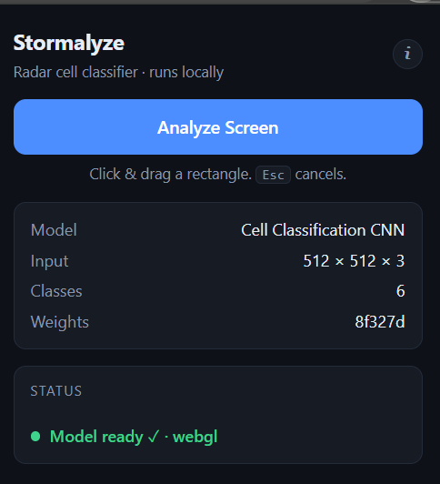
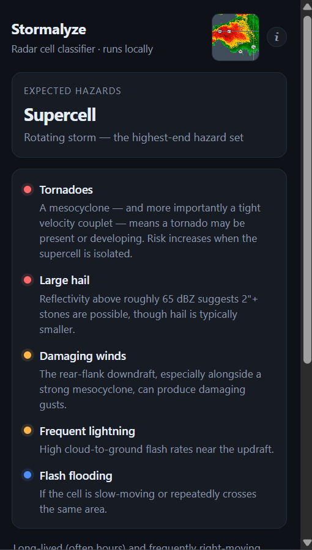
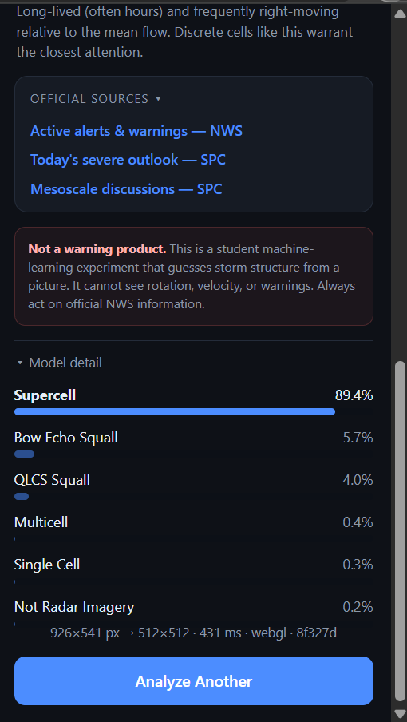
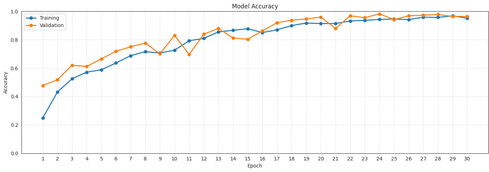
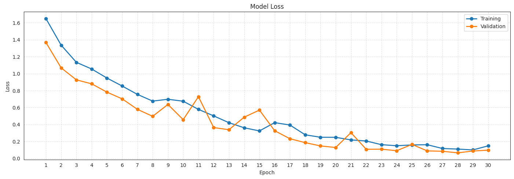

# Stormalyze

A Chrome extension that snips any region of a webpage and classifies it as one of six
radar storm morphologies using a custom CNN — running entirely on-device via TensorFlow.js.
No server, no upload, no network call after install.

## Demo

<video src="https://github.com/user-attachments/assets/cf4ff71f-af20-43e5-8e9c-4075cff5e3bf" controls width="700"></video>

## How it works

1. Click the extension icon, then drag a box around a radar cell on any page.
2. A TensorFlow.js port of a Keras CNN classifies the crop in-browser.
3. The popup shows the storm type and its typical hazards (not a live forecast — reference
   info for that storm structure, plus links to official NWS/SPC sources).

<table>
<tr>
<td> Idle — model loaded, ready to snip</td>
<td> Result — storm type + hazard list</td>
<td> Model detail — raw class probabilities</td>
</tr>
</table>

## Model

- Custom 5-block CNN (Conv2D + MaxPooling, 32→512 filters) with global average pooling,
  trained from scratch on ~1,000 hand-labeled NOAA radar images across 6 classes
- ~96% validation accuracy
- Converted from Keras to TensorFlow.js with verified exact weight transfer and
  numerically-matched preprocessing (browser output agrees with Keras to ~1e-6)

<table>
<tr>
<td></td>
<td></td>
</tr>
</table>

## Architecture notes

Built around Manifest V3's constraints: the service worker has no DOM and can't run the
model, and the popup is destroyed every time it loses focus. An **offscreen document**
keeps TensorFlow.js and its compiled WebGL shaders resident between analyses, so only the
first prediction pays the load cost.

Permissions are limited to `activeTab`, `scripting`, `storage`, and `offscreen` — no
`<all_urls>`, so Chrome shows no broad data-access warning.

## Tech

JavaScript · TensorFlow.js · Keras/TensorFlow (model training) · Chrome Manifest V3

## Install (unpacked)

1. `chrome://extensions` → enable **Developer mode**
2. **Load unpacked** → select this folder
3. Pin the extension and click its icon on any page showing radar imagery

## Disclaimer

This is a student ML project, not affiliated with NOAA or the NWS. It classifies image
*appearance* only — it cannot see rotation, velocity, or active warnings. Always act on
official NWS information, not this tool.
